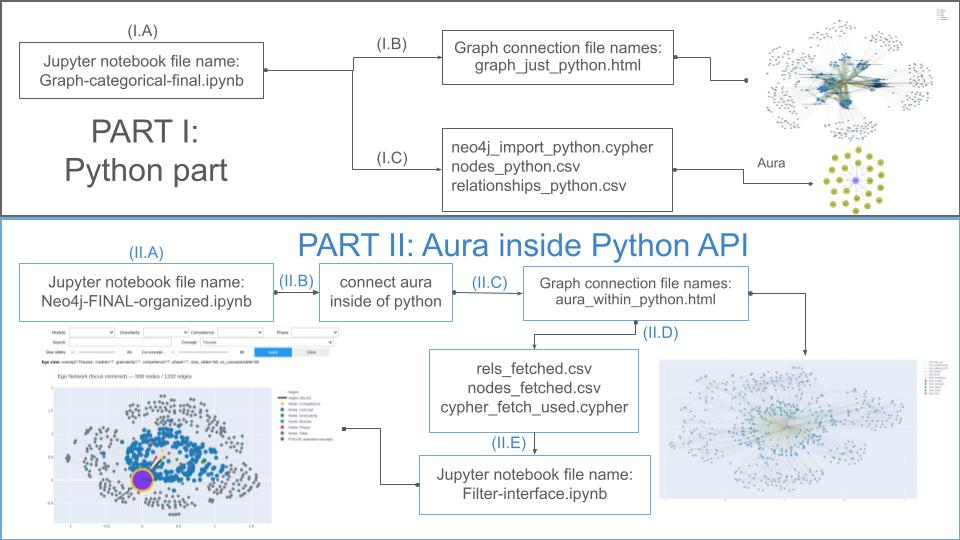

# Python Neo4j Graph Workflow

Python and Neo4j/Aura workflow for graph construction, export, and interactive HTML visualization.

This repository organizes the project into two complementary parts:

- **Part I:** graph generation and export using Python only
- **Part II:** Neo4j Aura integration inside the Python API, including graph retrieval and filtering outputs

## Repository and live site

- **Source repository:** [python-neo4j-graph-workflow](https://github.com/MariusOech/python-neo4j-graph-workflow)
- **Live GitHub Pages site:** [mariusoech.github.io/python-neo4j-graph-workflow](https://mariusoech.github.io/python-neo4j-graph-workflow/)

## Workflow overview

The following scheme summarizes the full workflow used in this repository, from the Python-only graph construction to the Aura-integrated workflow.



---

## Repository structure

```text
python-neo4j-graph-workflow/
├── README.md
├── Marius-scheme-Update.jpg
├── graph_just_python.html
├── aura_within_python.html
├── notebooks/
│   ├── Graph-categorical-final.ipynb
│   ├── Neo4j-FINAL-organized.ipynb
│   └── Filter-interface.ipynb
└── exports/
    ├── neo4j_import_python.cypher
    ├── nodes_python.csv
    ├── relationships_python.csv
    ├── cypher_fetch_used.cypher
    ├── nodes_fetched.csv
    └── rels_fetched.csv
```

---

## Part I: Python part

This first part corresponds to the **Python-only workflow**, where the graph is built and exported directly from Python.

### Main notebook

- `notebooks/Graph-categorical-final.ipynb`

### Generated files

- `graph_just_python.html` – interactive HTML graph generated from the Python workflow
- `exports/neo4j_import_python.cypher` – Cypher script for graph import
- `exports/nodes_python.csv` – exported node table
- `exports/relationships_python.csv` – exported relationship table

### Description

In this stage, the graph is created locally in Python and exported in multiple formats. The HTML file provides an interactive visualization of the generated graph, while the CSV and Cypher files allow import into Neo4j-compatible environments.

### Interactive output

[Open the Python-generated graph](https://mariusoech.github.io/python-neo4j-graph-workflow/graph_just_python.html)

If the page does not load immediately, wait a few minutes for GitHub Pages deployment to finish and refresh the site.

---

## Part II: Aura inside Python API

This second part corresponds to the **Neo4j Aura workflow inside Python**, where Python connects to Aura, fetches graph elements, and generates additional interactive and filtered outputs.

### Main notebooks

- `notebooks/Neo4j-FINAL-organized.ipynb`
- `notebooks/Filter-interface.ipynb`

### Generated files

- `aura_within_python.html` – interactive HTML graph generated from the Aura-connected workflow
- `exports/cypher_fetch_used.cypher` – Cypher query used to fetch graph data
- `exports/nodes_fetched.csv` – fetched nodes exported from Aura
- `exports/rels_fetched.csv` – fetched relationships exported from Aura

### Description

In this stage, Python interacts directly with Neo4j Aura through the API. The workflow retrieves nodes and relationships, exports them as CSV and Cypher-based outputs, and generates an additional interactive HTML visualization. The filtering notebook is used to refine and inspect the graph after data retrieval.

### Interactive output

[Open the Aura-generated graph](https://mariusoech.github.io/python-neo4j-graph-workflow/aura_within_python.html)

If the page does not load immediately, wait a few minutes for GitHub Pages deployment to finish and refresh the site.

---

## Notebooks summary

### `Graph-categorical-final.ipynb`

Builds the graph structure in Python and exports the initial visualization and import files.

### `Neo4j-FINAL-organized.ipynb`

Connects Python to Neo4j Aura, queries the graph, and exports retrieved graph objects and visualization files.

### `Filter-interface.ipynb`

Provides the filtering and inspection interface for the Aura-based graph workflow.

---

## How to use

1. Open the notebooks in the `notebooks/` folder.
2. Run the notebook corresponding to the workflow you want:
   - `Graph-categorical-final.ipynb` for the Python-only workflow
   - `Neo4j-FINAL-organized.ipynb` for the Aura-integrated workflow
   - `Filter-interface.ipynb` for filtering and inspection
3. Open the generated HTML files through the GitHub Pages links above, or locally in your browser.
4. Use the CSV and Cypher files in `exports/` for downstream analysis or Neo4j import.

---

## Notes

- The figure `Marius-scheme-Update.jpg` provides a visual summary of the two-part workflow.
- The HTML files are included as illustrative interactive outputs.
- The CSV and Cypher files document the graph structure both before and after Aura integration.
